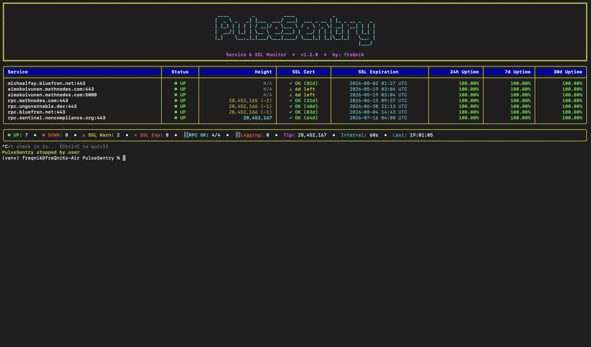

# PulseSentry

Uptime &amp; SSL Checker and RPC Height Verification with Telegram Nontifications


## Features


- **TCP service monitoring** — verifies any `host:port` is reachable
- **SSL certificate checks** — reports expiration date and days remaining
- **Blockchain RPC monitoring** — auto-detects RPC endpoints (any host containing `rpc`) and queries `/status` for latest block height
- **Lag detection** — flags RPCs more than 100 blocks behind the highest peer as DOWN
- **Uptime tracking** — rolling 24h / 7d / 30d uptime percentages stored in SQLite
- **Telegram alerts** — notifications for downed services, lagging RPCs, expired certs, and certs expiring within 15 days
- **Rich terminal UI** — color-coded dashboard with status, height, SSL info, and uptime stats


## Requirements


- Python 3.8+
- A Telegram bot token and chat ID (optional, only needed for alerts)


## Installation


Clone or download the script, make a virtual environment, then install dependencies:


```bash
git clone https://github.com/freQniK/PulseSentry && cd PulseSentry && python3 -m venv venv && source venv/bin/activate && pip install -r requirements.txt 
```


## Configuration

Set your Telegram credentials as environment variables:

```bash
export TELEGRAM_BOT_TOKEN="123456:ABC-DEF..."
export TELEGRAM_CHAT_ID="123456789"
```

To get these:

1. Create a bot via [@BotFather](https://t.me/BotFather) on Telegram
2. Message your new bot, then visit `https://api.telegram.org/bot<TOKEN>/getUpdates` to find your chat ID

## Input File

Create a plain text file listing services to monitor, one `host:port` per line. Lines starting with `#` are treated as comments.

Example `services.txt`:

```
google.com:443
github.com:443
rpc.sentinel.co:443
rpc.cosmos.network:443
1.1.1.1:443
```

Any hostname containing `rpc` is automatically treated as a blockchain RPC endpoint and queried at `https://host:port/status`.

## Usage

Run continuously with a check interval (in seconds):

```bash
python3 pulsesentry.py services.txt --interval 60
```

Run a single check and exit (useful for cron):

```bash
python3 pulsesentry.py services.txt --once
```

### Arguments

| Flag         | Description                          | Default |
| ------------ | ------------------------------------ | ------- |
| `input_file` | Path to the services list (required) | —       |
| `--interval` | Seconds between check cycles         | 60      |
| `--once`     | Run once and exit                    | off     |

## 

## Screenshot




## Alert Behavior

PulseSentry sends Telegram alerts when:

- A service goes DOWN
- An RPC is 100+ blocks behind the network tip (lagging)
- An SSL certificate is expired
- An SSL certificate expires within 15 days

Alerts have a 6-hour cooldown per service/alert-type to avoid spam.

## Configuration Constants

Edit these at the top of the script to tune behavior:

| Constant               | Description                               | Default |
| ---------------------- | ----------------------------------------- | ------- |
| `SSL_WARNING_DAYS`     | Days before expiry to start warning       | 15      |
| `CONNECT_TIMEOUT`      | Socket/HTTP timeout in seconds            | 10      |
| `ALERT_COOLDOWN_HOURS` | Hours between repeat alerts               | 6       |
| `RPC_LAG_THRESHOLD`    | Blocks behind tip before marking RPC down | 100     |

## Data Storage

A local SQLite database (`pulsesentry.db`) is created in the working directory to track uptime history. Data older than 31 days is automatically pruned.

## Running as a Service

To run PulseSentry as a systemd service, create `/etc/systemd/system/pulsesentry.service`:

```ini
[Unit]
Description=PulseSentry Monitor
After=network.target

[Service]
Type=simple
User=youruser
WorkingDirectory=/path/to/pulsesentry
Environment="TELEGRAM_BOT_TOKEN=your_token"
Environment="TELEGRAM_CHAT_ID=your_chat_id"
ExecStart=/usr/bin/python3 /path/to/pulsesentry.py /path/to/services.txt --interval 60
Restart=always

[Install]
WantedBy=multi-user.target
```

Then enable and start:

```bash
sudo systemctl enable --now pulsesentry
```

## License

MIT


# Buy me a coffee:

Donations help us provide more software for people like you! Crypto was made for supporting your developers.

### Bitcoin


```
bc1pxuw8nakll36829gd54veyu90ykh9jlrswjjxe9plcufjq8rgq3hqzrwdsd
```

### Monero


```
88XtF4MzPp4bdTxyYaa7TNhewDD1DELDS5qqyecrwZhvj7jPnyiDjLf1tNw9gqhTen9hv9fvZQJwsCzjxTPoj6266EbmrGR
```

### Pirate Chain


```
zs1cxyj35lfyvg66twsuf422ttptyqulhlftwfnap808ddeuqu32x0t4h5dxawqy7ar9jpuqhh293g
```

### Sentinel


```
sent1y98hv7sjcgf8ehtjdkgpt8vqq2qzx5wk56042h
```
